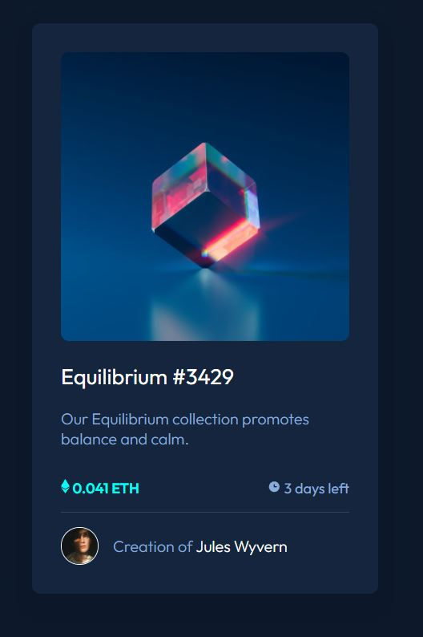

# Frontend Mentor - NFT preview card component solution

This is a solution to the [NFT preview card component challenge on Frontend Mentor](https://www.frontendmentor.io/challenges/nft-preview-card-component-SbdUL_w0U). Frontend Mentor challenges help you improve your coding skills by building realistic projects.

## Table of contents

- [Overview](#overview)
  - [The challenge](#the-challenge)
  - [Screenshot](#screenshot)
- [My process](#my-process)
  - [Built with](#built-with)
  - [What I learned](#what-i-learned)
  - [Continued development](#continued-development)
- [Author](#author)

## Overview

### The challenge

Users should be able to:

- View the optimal layout depending on their device's screen size
- See hover states for interactive elements

### Screenshot

## My process

### Built with

- Semantic HTML5 markup
- CSS custom properties
- Flexbox
- [React](https://reactjs.org/) - JS library

### What I learned

This was the first project that I worked on without a guide or tutorial and showed me how important it is to practice these skills outside of learning them. There were lots of things that I take for granted that I struggled with in implementing this. This project helped me better understand how to implement the css I have learned as well as use properties I'm not used to.

### Continued development

Going forward I would like to learn more about how flex positioning works and the best practices for using it vs grid. Another topic I struggled with in this project was orginization. I tried to stay orginized but the further I got in the project the less orginized my project became. Completing this project helped me get a bigger picture of the whole when implementing and will help me to better stay orginized in my future projects.

## Author

- Website - [Robert Rynard](https://github.com/Robert-Rynard)
- Frontend Mentor - [@Robert-Rynard](https://www.frontendmentor.io/profile/Robert-Rynard)
- Twitter - [@robert_rynard](https://www.twitter.com/robert_rynard)
